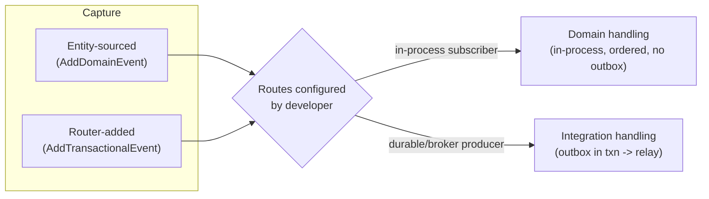
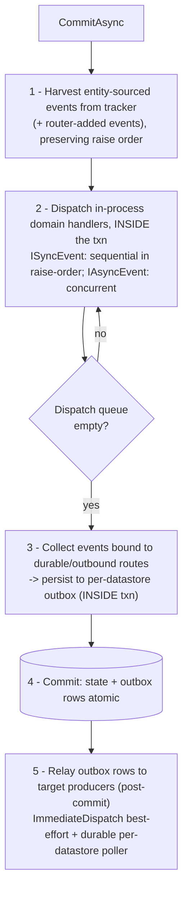
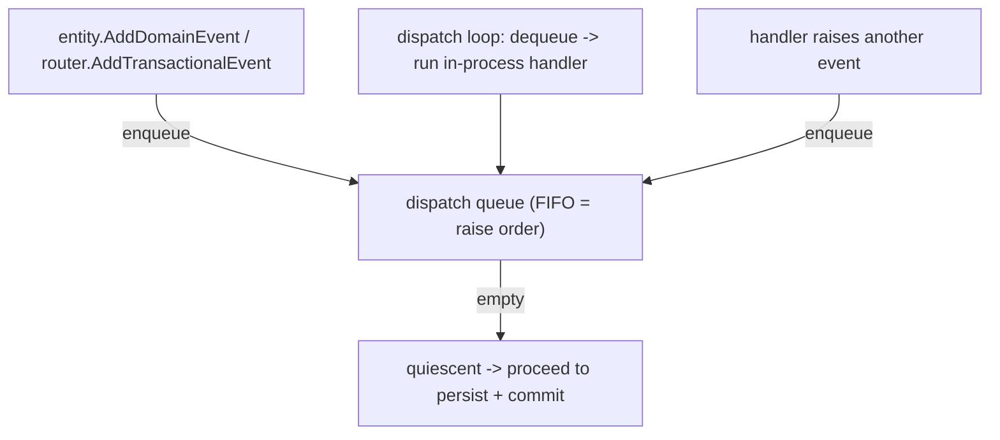
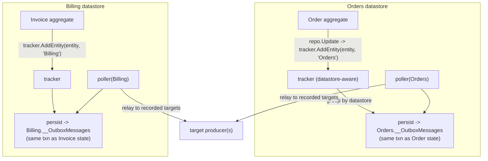
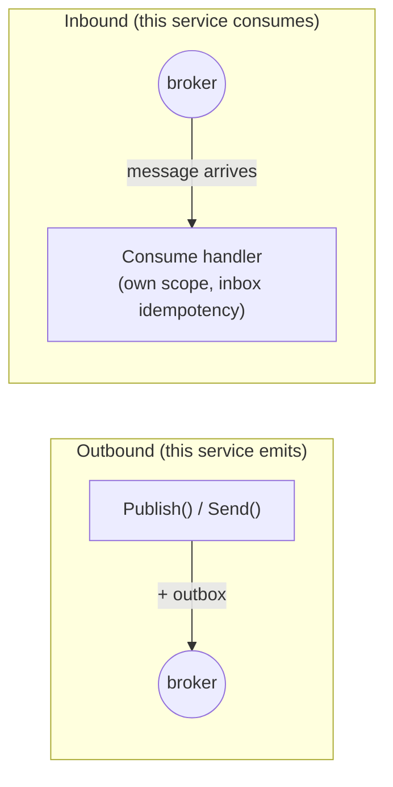
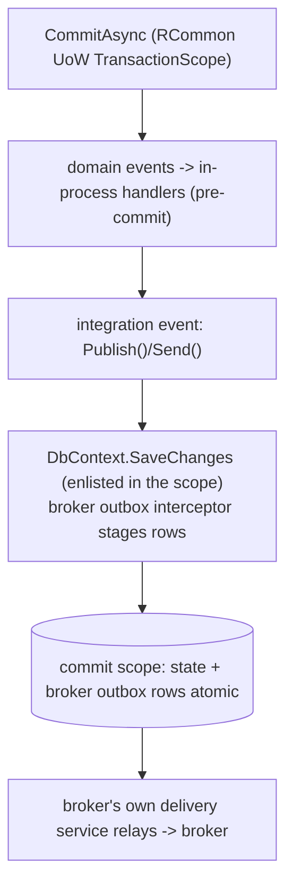

# Event Handling & Transactional Outbox — Recipe-Based Redesign

- **Date:** 2026-07-22
- **Status:** Design (approved for spec review)
- **Target version:** 3.2.0 (breaking, accepted)
- **Supersedes/extends:** `2026-07-14-outbox-producer-processor-topology-design.md`

## Context & problem statement

RCommon's event-handling surface has grown three **disjoint outbox stories** and no unifying model:

1. **RCommon's own EFCore outbox** (`AddOutbox<TOutboxStore>`) integrates with `UnitOfWork.CommitAsync`'s phases via `IEntityEventTracker` / `IEventRouter` / `IOutboxStore`.
2. **MassTransit's outbox** (`RCommon.MassTransit.Outbox`) is a thin passthrough to `AddEntityFrameworkOutbox` — it does **not** touch RCommon's UoW/tracker/router.
3. **Wolverine's outbox** (`RCommon.Wolverine.Outbox`) is likewise a passthrough to `UseEntityFrameworkCoreTransactions`.

On top of that:

- There is **no type-level domain-vs-integration distinction**, and there shouldn't be one imposed by the framework. `IDomainEvent` exists only as `ISerializableEvent` + timestamps; `AggregateRoot` keeps both `DomainEvents` and `LocalEvents`; there is no integration-event concept.
- The flagship declarative path (`AddDomainEvent`/`AddLocalEvent` → `CommitAsync` → outbox) only works with RCommon's own outbox.
- RCommon's own outbox has a confirmed correctness defect (**B4**): a single global tracker + single pinned store funnel **every** datastore's events into one outbox table, misrouting non-default-datastore events to the wrong database and losing atomicity (a re-opened dual-write/2PC hole).

This redesign establishes a single, coherent, **recipe-driven** event-handling model that spans all transports, fixes B4, and treats every event uniformly while letting the developer configure domain/integration semantics.

### Guiding principles (from stakeholder direction)

1. **RCommon treats all events uniformly.** "Domain" vs "integration" is a consequence of how the developer *routes* an event, never a type the framework imposes.
2. **Domain events are in-process and ordered; integration events cross the boundary and need durability.** The outbox is a property of the *route/transport*, not of the event.
3. **Sync-event ordering matters** (domain-event sequencing in DDD) and must be correct and explicitly verified.
4. **The fluent configuration must be unambiguous** — an event's destination and durability are visible at the composition root.
5. **Every recipe is proven by a runnable example** and diagrammed (mermaid, reused in docs).

## Goals

- Fix the cross-datastore outbox misroute (B4) by threading datastore identity through the whole path.
- Provide one uniform event model with a route-based (not type-based) domain/integration distinction.
- Reorder the UoW commit pipeline so domain handlers run pre-commit, ordered, in-transaction.
- Provide an unambiguous fluent API separating **delivery strategy** (publish/send/in-process) from **durability** (RCommon outbox / broker outbox / none).
- Wrap MassTransit's and Wolverine's native outbox configuration in RCommon idioms and prove the UoW↔broker-outbox coordination.
- Deliver five application-architecture recipes as runnable, tested examples with diagrams.

## Non-goals

- Imposing an `IIntegrationEvent`/`IDomainEvent` type split (explicitly rejected).
- A discrete first-class `AddOutboxProducer`/`AddOutboxProcessor` API split (U6) — topology is formalized via per-datastore registration and the recipes; the discrete split can fold in later.
- Replacing MassTransit's/Wolverine's outbox internals (we wrap and coordinate, not reinvent).
- Building a mediator-native outbox. MediatR / the native Mediator are in-process and have no outbox; durability for a mediator route, when wanted, is provided by RCommon's per-datastore outbox (relayed post-commit) — not a new mediator persistence mechanism.
- The MediatR/native-mediator **CQRS request pipeline** (command/query handling, `AddUnitOfWorkToRequestPipeline`) is out of scope here; this design concerns the mediator only as an **event-handling** (producer/subscriber) transport.

---

## 1. Core model & vocabulary

- **Event** — anything implementing `ISerializableEvent`. No framework-imposed domain/integration type. `IDomainEvent` / `AggregateRoot.AddDomainEvent` remain ergonomic helpers, not semantic gates.
- **Capture path** — how an event enters a unit of work; tracked explicitly:
  - **Entity-sourced** — raised on an aggregate/entity (`AddLocalEvent`/`AddDomainEvent`), harvested by `IEntityEventTracker`.
  - **Router-added** — added imperatively via `IEventRouter.AddTransactionalEvent` (the non-DDD / transaction-script path).
- **Route** — an event→producer binding (modeled by `EventSubscriptionManager`). Two orthogonal properties describe a route:
  - **Transport** — one of three destination categories:
    1. **In-process bus** (`InMemoryEventBusBuilder`) — `IEventBus` pub/sub to `ISubscriber<T>`.
    2. **In-process mediator** (`MediatREventHandlingBuilder`, native `MediatorEventHandlingBuilder`) — dispatch through the mediator pipeline; `Publish` = notification/fan-out, `Send` = request/point-to-point. Still in-process. **No native outbox.**
    3. **Broker** (`MassTransitEventHandlingBuilder`, `WolverineEventHandlingBuilder`) — crosses the process boundary; has a native outbox.
  - **Durability** — transient (no outbox) or durable. Durability is *orthogonal to transport*: any route can be made durable via RCommon's per-datastore outbox (`.UseOutbox`); only broker transports additionally offer their *native* outbox (`UseBrokerOutbox`).
- **Domain vs integration** = purely which route(s) an event is bound to; developer-configured. A transient in-process route (bus or mediator) is domain handling; a route that leaves the process, or is made durable, is integration handling. The same event can be both.
- **Outbox** = a property of a durable route; physically **per-datastore** (co-located with the state change for atomicity), each row recording its **target producer(s)**.

> **In-process mediator note (MediatR / native Mediator).** These implement the producer/subscriber pattern entirely in memory and have **no outbox of their own**. They behave like the in-memory bus for the purposes of this design: transient mediator routes participate in the **pre-commit, ordered domain dispatch** (§2) alongside bus subscribers; a mediator route made durable via `.UseOutbox("store")` is persisted to RCommon's per-datastore outbox and **relayed post-commit** by the poller invoking the mediator producer. `UseBrokerOutbox` does not apply to mediator transports (they are not brokers). This is the "account for MediatR" case: durability, when wanted, always comes from RCommon's outbox — never a mediator-native one.



---

## 2. The unit-of-work commit pipeline

Today's order is *persist-outbox → commit → dispatch (post-commit)*. To make pre-commit, ordered, in-transaction domain dispatch work — and let a domain handler transactionally produce an integration event — the pipeline is reordered:



### FIFO dispatch queue (replaces a re-harvest loop)

In-process domain dispatch is modeled as a **single ordered FIFO queue drained to empty**, not a "re-harvest and compare" loop:



- **Single pass** — each event enqueued once, dequeued once; no repeated aggregate-graph re-walks.
- **Intrinsic termination** — the queue empties; no before/after bookkeeping.
- **Ordering for free** — FIFO *is* raise-order, so `ISyncEvent` sequencing is a data-structure property.
- **`IAsyncEvent` semantics** — async events are **dequeued in raise-order** but their handlers are **awaited concurrently** within a contiguous run of async events; the queue still advances one entry at a time, so an async handler that raises further events enqueues them to the *same* FIFO and the single-drain invariant is preserved (no separate queue, no re-harvest). Ordering guarantees apply to `ISyncEvent`; `IAsyncEvent` guarantees only that all handlers complete before the queue is considered empty.
- **Leverages existing machinery** — `BusinessEntity.AddLocalEvent` already raises `TransactionalEventAdded`; the tracker subscribes and enqueues, so events raised mid-dispatch flow into the same queue. `OutboxEventRouter` already has a buffer queue.
- **Cycle-breaker** — a guard fails loud on unbounded cascades (A→B→A…). "Depth" means **cascade generation** (the event that triggered the handler is generation *n*; events that handler raises are generation *n+1*), not total events dispatched — a wide fan-out at one generation is fine. The default limit and its config knob live on the event-handling options (default: 16 generations); exceeding it throws a descriptive exception (fail-loud), it is a safety net, not the termination mechanism (empty-queue is).

### Consequences

- Sync domain events fire in raise-order **pre-commit**; asserted by an explicit ordering test.
- A domain handler calling `AddTransactionalEvent(integrationEvt)` lands that outbox row in the same commit (transactional translation).
- Any pre-commit handler throwing rolls back everything: no state, no outbox rows, no relay (all-or-nothing).
- Guardrail (documented): pre-commit in-transaction domain handlers should stay in-process and side-effect-light (no external I/O inside the transaction).
- Back-compat: `CommitAsync` internals reorder; the observable single-host outcome (events delivered after commit) is preserved. Pre- vs post-commit domain dispatch is the semantic change called out in migration notes.

---

## 3. Per-datastore outbox & the cross-datastore fix (B4/U5)

**Invariant:** an event's outbox row must be written to the same DbContext/transaction as the state change that produced it. Today one global tracker funnels every datastore's events into one pinned store, so a non-default-datastore aggregate's event is written to the wrong DB and loses atomicity. The fix threads datastore identity through the path instead of discarding it.



### How identity threads through

Datastore is known where the EF layer tracks the entity (the repository has `DataStoreName`; the `RCommonDbContext` knows its own name).

1. **Capture** — `IEntityEventTracker.AddEntity(entity, dataStoreName)`; the in-memory tracker stores `(entity, dataStoreName)` instead of a flat list. Existing `AddEntity(entity)` kept as an overload defaulting to the default datastore.
2. **Route/group** — `OutboxEntityEventTracker` groups harvested events by datastore and persists each group into that datastore's outbox.
3. **Persist** — `IOutboxStore.SaveAsync(message, dataStoreName, ct)` becomes datastore-parametric; one `EFCoreOutboxStore` resolves the correct `RCommonDbContext` per call via `IDataStoreFactory`. Removes the pinned-at-construction limitation and the per-store subclass boilerplate (**U5**).
4. **Poll** — `OutboxProcessingService` claims/drains from **each registered outbox datastore**.
5. **Register** — outbox registration declares which datastore(s) own an outbox (defaulting to the default datastore).

### Target producers per row

Each `OutboxMessage` gains a **target** field recording which durable route(s)/producer(s) it should relay to (derived from the event→producer map at persist time). The datastore's poller reads it and dispatches to exactly those producers. This lets one per-datastore table serve multiple transports and enables recipe 2a (broker-as-producer).

### Schema provisioning

- The base `RCommonDbContext` **auto-applies** the `OutboxMessage` mapping for any datastore registered as owning an outbox (no manual `AddOutboxMessages` call).
- The developer owns EF **migrations** (RCommon cannot own migration history).
- A **startup diagnostic fails loud** if a registered outbox datastore's model/table is missing (consistent with the 3.1.3 fail-loud direction).

### Breaking changes (3.2.0)

- `IEntityEventTracker.AddEntity` gains a datastore-aware overload (old signature preserved, defaults to default datastore).
- `IOutboxStore.SaveAsync` gains a `dataStoreName` parameter — breaking for custom `IOutboxStore` implementers (rare).
- `EFCoreOutboxStore` no longer pins a datastore at construction → the `EFCoreOutboxStore<TContext>`/subclass pattern is obsolete.

---

## 4. Fluent configuration API

**Rule:** the destination of an event is visible at the composition root, and each event-handling builder *is* a destination.

- **In-memory builder → in-process (domain) destination.** Subscribers are domain handlers: pre-commit, ordered, no outbox.
- **Broker builder (MassTransit/Wolverine) → outbound (integration) destination.** Events routed here leave the process; durability is configured on the builder.

An event that is both domain and integration is registered on both builders — explicit, greppable, no hidden typing.

### Orthogonal axes: delivery strategy vs durability

Delivery strategy and durability are independent and never conflated.

| Intent | Verb | Delivery | Durability modifier |
|---|---|---|---|
| In-process domain handler | `AddSubscriber<T,H>()` | in-process pub/sub | none (transient, pre-commit) |
| Fan-out integration event | `Publish<T>()` | pub/sub | `.UseOutbox("store")` or builder `UseBrokerOutbox(…)` |
| Point-to-point / queued | `Send<T>()` | queue | `.UseOutbox("store")` or builder `UseBrokerOutbox(…)` |
| Inbound broker consumption | `Consume<T,H>()` | broker consumer (own scope, inbox idempotency) | n/a |

`Publish` always means fan-out; `Send` always means point-to-point; neither implies anything about the outbox. `Publish<T>()`/`Send<T>()` auto-register their corresponding producer for the builder (as `AddSubscriber` already auto-registers the in-memory producer).

**`Publish`/`Send` are transport-agnostic delivery verbs.** They apply on the **in-process mediator** builders (`MediatREventHandlingBuilder`, native `MediatorEventHandlingBuilder`) exactly as on broker builders — `Publish` maps to the mediator's notification/fan-out producer, `Send` to its request/point-to-point producer. The only difference is durability: a mediator route may take the per-event `.UseOutbox("store")` modifier (RCommon outbox), but **not** `UseBrokerOutbox` (there is no mediator-native outbox). Consuming from a mediator is just in-process handler registration (`AddSubscriber<T,H>()`); `Consume<T,H>()` is broker-only.

### Inbound vs outbound



- `AddSubscriber<T,H>()` — in-process handler on the in-memory builder (domain, pre-commit, in the producer's UoW).
- `Consume<T,H>()` — inbound broker consumer on a broker builder (runs on the consuming host in its own scope/transaction, with inbox idempotency). `AddSubscriber` is kept as an `[Obsolete]` alias forwarding to `Consume` on broker builders for continuity.

### Canonical durability verb set

There are exactly two levels at which durability is expressed, and one precedence rule:

- **Per-event modifier** (chained on `Publish`/`Send`): `.UseOutbox("<datastore>")` — routes *this* event through RCommon's per-datastore outbox.
- **Builder-level selector** (sets the default for every outbound route on that builder):
  - `UseRCommonOutbox("<datastore>")` → recipe 2a (RCommon owns durability; broker relayed post-commit).
  - `UseBrokerOutbox(o => …)` → recipe 2b (broker's native outbox; RCommon coordinates the txn).
- **Precedence:** a per-event `.UseOutbox(...)` overrides the builder-level selector for that event (most specific wins). If neither a per-event modifier nor a builder-level selector applies, the broker publishes **without** an outbox (fire-at-commit).

`.UseOutbox("store")` and `UseRCommonOutbox("store")` select the *same* RCommon per-datastore outbox mechanism; they differ only in scope (single route vs whole builder). `UseBrokerOutbox` is the only verb that selects the broker's native outbox.

### Example — Recipe 1 (RCommon outbox)

```csharp
services.AddRCommon()
    .WithPersistence<EFCorePersistenceBuilder>(db =>
    {
        db.AddDataStore<OrdersDbContext>("Orders");
        db.AddOutbox(o => o.OnDataStore("Orders"));
    })
    .WithEventHandling<InMemoryEventBusBuilder>(events =>
    {
        events.AddSubscriber<OrderPlaced, RecalculateInventory>();   // domain: in-process, ordered
        events.AddSubscriber<OrderPlaced, UpdateOrderReadModel>();   // domain: in-process, ordered
        events.Publish<OrderConfirmed>().UseOutbox("Orders");        // integration: durable pub/sub
    });
```

### Example — Recipe 2b (MassTransit native outbox, both strategies)

```csharp
    .WithEventHandling<MassTransitEventHandlingBuilder>(events =>
    {
        events.UseBrokerOutbox(o => o.OnDataStore("Orders"));   // wraps MT AddEntityFrameworkOutbox
        events.Publish<OrderConfirmed>();                        // pub/sub
        events.Send<CapturePayment>();                           // queue
    });
```

Recipe 2a differs by exactly one verb: `events.UseRCommonOutbox("Orders")` in place of `UseBrokerOutbox(…)`, with the same `Publish`/`Send` routing.

---

## 5. MassTransit/Wolverine integration internals (recipe 2b)

### The wrapper

`UseBrokerOutbox(o => o.OnDataStore("Orders"))` translates an RCommon datastore name into the transport's native outbox setup, so the developer never drops to raw broker APIs or hand-wires a `DbContext`:

- **MassTransit** → `AddEntityFrameworkOutbox<OrdersDbContext>(...)` + `UseBusOutbox()`, with the `DbContext` resolved from the `"Orders"` datastore registration; provider (Postgres/SqlServer) inferred from the datastore.
- **Wolverine** → `UseEntityFrameworkCoreTransactions()` + durable outbox bound to the same datastore's `DbContext`.

This formalizes `RCommon.MassTransit.Outbox` / `RCommon.Wolverine.Outbox` from thin passthroughs into datastore-aware wrappers.

### Coordination model

RCommon's UoW `TransactionScope` encloses the `DbContext.SaveChanges` the broker's outbox interceptor uses to stage rows, so broker-outbox rows land in the same transaction as the aggregate's state:



### Verification-gated (the B3 risk)

Whether a `Publish`/`Send` issued inside RCommon's `TransactionScope`-based UoW (rather than inside a MassTransit `ConsumeContext` or Wolverine-managed transaction) stages **atomically** into the broker's outbox is the "DI seam unverified" concern from the original feedback (B3). Therefore:

- The plan **front-loads a coordination spike** — a Testcontainers integration test (real Postgres) asserting: state + broker-outbox rows commit atomically, and a rollback leaves neither. Recipe 2b is "done" only when that test is green.
- If the seam does not enclose cleanly for a given broker, the documented fallback is **recipe 2a** (broker as a producer behind RCommon's own outbox), which has no such coupling. Developers always have a correct path.

---

## 6. Recipe catalog, testing, versioning

### Recipe catalog → example projects

Each recipe ships with a mermaid diagram (reused in docs) and an e2e `.Tests` project.

| Recipe | Example project | Resolves/demos |
|--------|-----------------|----------------|
| 1 — DDD + UoW + RCommon per-datastore outbox | extend `Examples.EventHandling.Outbox` (+ a 2-datastore variant) | B4, U5 |
| 2a — DDD + UoW + broker as producer behind RCommon outbox | extend `Examples.Messaging.MassTransit` / `.Wolverine` | U3 |
| 2b — DDD + UoW + broker-native outbox (RCommon-wrapped) | new `…Messaging.*.NativeOutbox` (or variant) | B3 |
| 3 — Transaction-script / CRUD + UoW (router-added events) | new `Examples.EventHandling.TransactionScript` | non-DDD path |
| 4 — No UoW (direct publish / standalone outbox) | new `Examples.EventHandling.NoUnitOfWork` | escape hatch |
| 5 — DDD + UoW + in-process mediator (MediatR / native) | extend `Examples.EventHandling.MediatR` / `Examples.Mediator.MediatR` | in-process mediator transport; `Publish`/`Send` in-process; optional `.UseOutbox` for durable relay; no mediator-native outbox |

### Testing strategy

RCommon has **no real-DB integration harness today** (EF tests run on SQLite via `EnsureCreated`; outbox-store tests use mocked `IOutboxStore`; no Testcontainers). Part of this work is adding one.

- **RCommon `Tests/` — authoritative correctness gate (TDD, written first):**
  - *Unit tests* — FIFO queue ordering, pre-commit dispatch + cycle-breaker, per-datastore grouping/routing, target-producer recording, tracker datastore capture, multi-datastore poller, startup diagnostics. Fast, mock-based.
  - *Integration tests (new Testcontainers harness: Postgres + RabbitMQ)* — cross-datastore atomicity (row co-located; rollback erases both), `TransactionScope` enlistment, and the recipe-2b broker-outbox coordination spike. SQLite cannot exercise multi-connection atomicity or brokers.
- **Examples `+ .Tests` — executable proof-of-work per recipe:** each recipe is a runnable app with a lightweight end-to-end test (following the `Examples.EventHandling.Outbox.Tests` precedent) asserting the documented wiring composes and produces the recipe's observable outcome.

RCommon tests prove internals/invariants and guard against regression independent of examples; example tests prove the public recipe as documented actually works. The coordination spike lives in RCommon integration tests as the gate and is demonstrated in the recipe-2b example.

### Versioning & migration — 3.2.0 (breaking, accepted)

- **Breaking:** `IOutboxStore.SaveAsync` gains `dataStoreName`; `CommitAsync` phase reorder (pre-commit domain dispatch); new fluent verbs.
- **Softened with shims:** `AddEntity(entity)` overload kept (defaults to default datastore); `AddSubscriber` kept as `[Obsolete]` alias → `Consume` on broker builders; `EFCoreOutboxStore<TContext>`/subclass marked obsolete.
- **Deliverables:** a migration guide (old→new mapping), the recipe conceptual guide + diagrams, and the Testcontainers CI change.

### Phasing (detailed by the writing-plans step)

0. Testcontainers harness + recipe-2b coordination spike.
1. Datastore-aware tracker/router/store/poller (B4/U5).
2. Pipeline reorder + FIFO dispatch queue + ordering.
3. Fluent API (`Publish`/`Send`/`Consume` + outbox modifiers).
4. MassTransit/Wolverine wrappers + recipes 2a/2b.
5. Recipes as examples + e2e tests.
6. Docs (recipe guide + diagrams) + migration guide.

Two commitments must appear as **explicit, testable acceptance criteria** on their phases (not prose): the fail-loud startup diagnostic for a missing outbox schema (§3, phase 1) and the recipe-2b atomicity/rollback coordination spike with the recipe-2a fallback path (§5, phase 0/4).

---

## Feedback-issue mapping

| # | Feedback item | Status |
|---|---------------|--------|
| B4 | Global tracker funnels every datastore's events into one outbox (cross-datastore misroute / 2PC hole) | Directly resolved (§3) |
| U5 | `EFCoreOutboxStore` pins datastore at construction → subclass boilerplate | Directly resolved (§3) |
| U3 | `ProduceEventAsync` routing implicit at call site | Directly resolved (§4) |
| B3 | Wolverine/MassTransit outbox DI seam unverified | Resolved + proven (§5) |
| D1 | Missing distributed-events/outbox conceptual guide | Completed via recipe catalog + diagrams (§6) |
| U4 | Subscriber-registration duality confusing | Structurally clarified — `AddSubscriber` vs `Consume` (§4) |
| U7 | `ISyncEvent` conflates ordering with transport | Reaffirmed + verified — sync = pre-commit ordered dispatch (§2) |
| U6 | No first-class producer/processor split for `AddOutbox` | Partial/adjacent — topology formalized via per-datastore registration + recipes |

Already shipped previously (context, not this work): B1 (`ImmediateDispatch`, 3.1.1); B2, B5, U1, U2 (silent-failure hardening, 3.1.3).

## Risks & open questions

- **Broker-outbox coordination (B3)** is the primary technical risk; mitigated by the front-loaded spike and the recipe-2a fallback.
- **Testcontainers in CI** adds Docker as a CI dependency (Postgres + RabbitMQ); needs the build workflow updated and may lengthen CI.
- **Multi-target frameworks** (net8/net9/net10) — MassTransit/Wolverine and their EF outbox versions differ per TFM (as seen with Swashbuckle/OpenApi in 3.1.1); wrapper conditional compilation may be needed.
- **`TransactionScope` + async** enlistment semantics across providers must be validated by the integration harness, not assumed.
