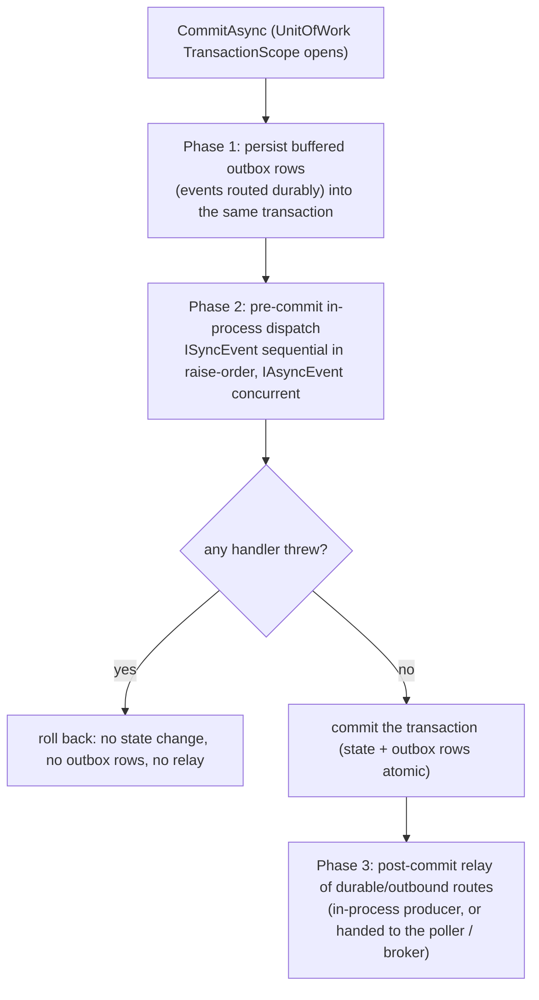
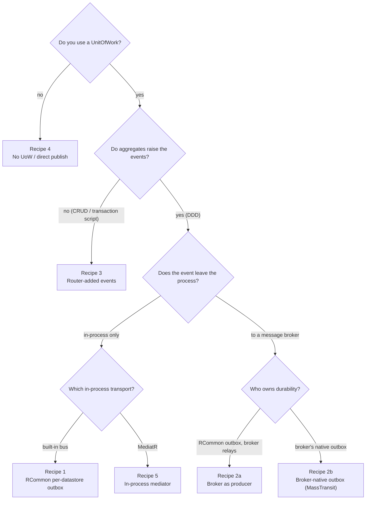
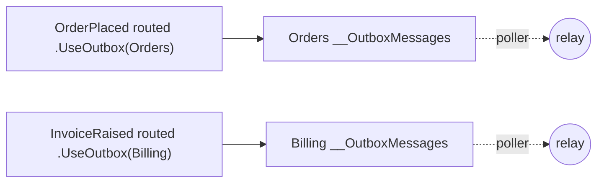
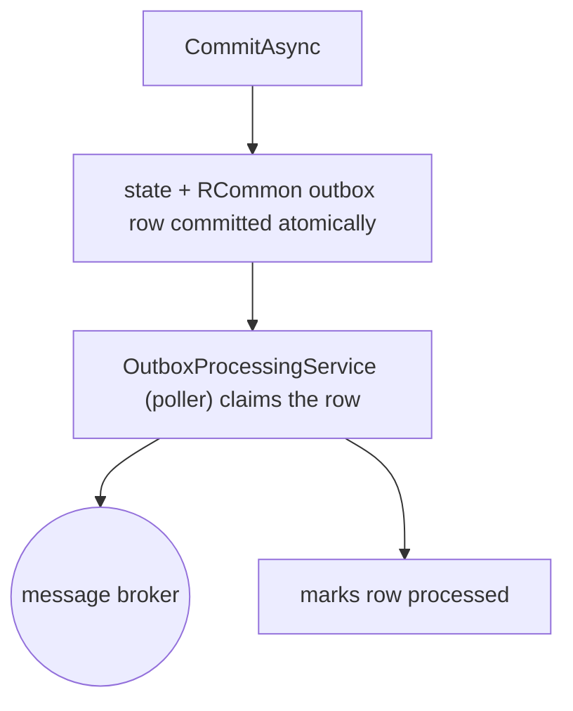

# Event Handling Recipes

RCommon 3.2.0 treats every event uniformly. There is no `IDomainEvent`/`IIntegrationEvent` type split: any type implementing `ISerializableEvent` can be raised and routed. Whether an event is handled **in-process** (domain-style: ordered, transactional, pre-commit) or **persisted and relayed** (integration-style: durable, cross-boundary) is decided entirely by *how you route it at the composition root* — never by the event's type.

This guide walks through the six recipes below — five distinct patterns, where the broker recipe has two variants (2a and 2b) that differ only in who owns the outbox. Each is a runnable project under [`Examples/`](https://github.com/RCommon-Team/RCommon/tree/main/Examples) with an end-to-end test, so the wiring shown here is exactly what ships.

## Two orthogonal choices

Every recipe is a combination of two independent decisions. Keeping them separate is the core idea of the 3.2.0 API.

1. **Delivery strategy — *how* does the event travel?**

   | Verb | Meaning | Available on |
   |------|---------|--------------|
   | `AddSubscriber<T,H>()` | In-process handler (domain-style, pre-commit, ordered) | In-memory, MediatR |
   | `Publish<T>()` | Fan-out (publish/subscribe) | In-memory, MediatR, brokers |
   | `Send<T>()` | Point-to-point (queued on brokers; request on a mediator) | MediatR, brokers |
   | `Consume<T,H>()` | Inbound broker consumer (own scope, inbox idempotency) | Brokers only |

2. **Durability — is the event *persisted* before it leaves?**

   Durability is **opt-in** and expressed at exactly two levels, with one precedence rule:

   - **Per-event:** chain `.UseOutbox("<datastore>")` onto `Publish`/`Send`.
   - **Builder-level default:** `UseRCommonOutbox("<datastore>")` (RCommon's own outbox) or `UseBrokerOutbox(...)` (the broker's native outbox).
   - **Precedence:** a per-event `.UseOutbox(...)` overrides the builder default for that event. If neither applies, the event is **transient** — dispatched in-process pre-commit, or published to the broker at commit, but never persisted.

:::warning Breaking change from earlier versions
Before 3.2.0, a tracked domain event was automatically written to the outbox. That implicit behavior is **gone**. An event with no durability modifier is transient. See the [3.2.0 migration guide](../api-reference/migration-guide.mdx#upgrading-to-320-event-handling--outbox-redesign).
:::

## The commit pipeline

For recipes that use a unit of work, `CommitAsync` runs a fixed pipeline. In-process domain handlers run **before** the transaction commits (so a handler failure rolls everything back); durable rows are persisted in the same transaction; outbound relay happens **after** commit.



Events raised *by* handlers during Phase 2 are enqueued to a single FIFO dispatch queue and drained to empty before commit. A runaway cascade beyond the configurable generation limit (default 16) throws a descriptive exception rather than looping forever.

## Choosing a recipe



| Recipe | Pattern | Example project |
|--------|---------|-----------------|
| [1](#recipe-1--ddd--rcommon-per-datastore-outbox) | DDD + UoW + RCommon per-datastore outbox | `Examples.EventHandling.Outbox` |
| [2a](#recipe-2a--broker-as-producer-behind-the-rcommon-outbox) | DDD + UoW + broker as producer behind the RCommon outbox | `Examples.Messaging.MassTransit` / `.Wolverine` |
| [2b](#recipe-2b--broker-native-outbox-masstransit) | DDD + UoW + broker-native outbox (RCommon-wrapped) | `Examples.Messaging.MassTransit.NativeOutbox` |
| [3](#recipe-3--transaction-script--router-added-events) | Transaction-script / CRUD + UoW (router-added events) | `Examples.EventHandling.TransactionScript` |
| [4](#recipe-4--no-unit-of-work-direct-publish) | No UoW (direct publish / standalone outbox) | `Examples.EventHandling.NoUnitOfWork` |
| [5](#recipe-5--in-process-mediator-mediatr) | DDD + UoW + in-process mediator (MediatR) | `Examples.EventHandling.MediatR` |

---

## Recipe 1 — DDD + RCommon per-datastore outbox

The default DDD recipe: an aggregate raises a domain event, in-process subscribers run pre-commit, and an event you mark durable is written to **that datastore's** outbox and relayed after commit. The outbox row always lands in the same `DbContext`/datastore/transaction as the state change that produced it, so events from one datastore are never written to another datastore's outbox table.

```csharp
services.AddRCommon()
    .WithSimpleGuidGenerator()
    .WithUnitOfWork<DefaultUnitOfWorkBuilder>(uow => { })
    .WithPersistence<EFCorePersistenceBuilder>(ef =>
    {
        ef.AddDbContext<AppDbContext>("AppDb", o => o.UseSqlServer(connectionString));
        ef.SetDefaultDataStore(ds => ds.DefaultDataStoreName = "AppDb");
        ef.AddOutbox<EFCoreOutboxStore>(dataStoreName: "AppDb");
    })
    .WithEventHandling<InMemoryEventBusBuilder>(events =>
    {
        events.AddSubscriber<OrderPlacedEvent, OrderPlacedEventHandler>(); // in-process, pre-commit
        events.Publish<OrderPlacedEvent>().UseOutbox("AppDb");             // durable: persist + relay
    });
```

The aggregate raises the event; committing the unit of work drives delivery:

```csharp
var order = new Order { CustomerName = "Ada Lovelace", Total = 249.99m };
order.Place(); // raises OrderPlacedEvent via AddDomainEvent

using var uow = unitOfWorkFactory.Create();
await orders.AddAsync(order);
await uow.CommitAsync(); // persists one __OutboxMessages row, dispatches the subscriber, marks the row processed
```

:::note Mechanism
Once an event type is declared durable, it is buffered into the outbox **within the transaction** and dispatched by `OutboxEventRouter.RouteEventsAsync` (post-commit, via the in-process producer) which then marks the row processed. `AddSubscriber` alone is transient; `Publish<T>().UseOutbox(...)` is what makes it durable.
:::

### Multiple datastores

Register an outbox per datastore. An event published `.UseOutbox("Billing")` lands **only** in Billing's outbox — never in Orders'.

```csharp
.WithPersistence<EFCorePersistenceBuilder>(ef =>
{
    ef.AddDbContext<OrdersDbContext>("Orders",  o => o.UseSqlServer(ordersConn));
    ef.AddDbContext<BillingDbContext>("Billing", o => o.UseSqlServer(billingConn));
    ef.AddOutbox<EFCoreOutboxStore>(dataStoreName: "Orders");
    ef.AddOutbox<EFCoreOutboxStore>(dataStoreName: "Billing");
})
```



---

## Recipe 2a — broker as producer behind the RCommon outbox

Use RCommon's own per-datastore outbox for durability, then relay each row to a message broker (MassTransit or Wolverine) after commit. RCommon owns the atomic write; the broker is just the transport. This recipe has no dependency on the broker's own outbox coordination, so it works for **both** MassTransit and Wolverine.

```csharp
.WithPersistence<EFCorePersistenceBuilder>(ef =>
{
    ef.AddDbContext<AppDbContext>("Orders", o => o.UseNpgsql(connectionString));
    ef.SetDefaultDataStore(ds => ds.DefaultDataStoreName = "Orders");
    // Producer host: persist only, leave delivery to the poller.
    ef.AddOutbox<EFCoreOutboxStore>(o => o.ImmediateDispatch = false, dataStoreName: "Orders");
})
.WithEventHandling<MassTransitEventHandlingBuilder>(events =>
{
    events.UseRCommonOutbox("Orders"); // builder default: durability via the RCommon outbox
    events.Publish<OrderConfirmed>();  // relayed to the broker post-commit by the poller
    events.UsingRabbitMq((ctx, cfg) => cfg.ConfigureEndpoints(ctx));
});
```

The Wolverine variant is identical except the transport is wired on the host (`builder.Host.UseWolverine(...)`) and the builder is `WolverineEventHandlingBuilder`.



---

## Recipe 2b — broker-native outbox (MassTransit)

Let MassTransit's own EF Core outbox stage the message, with RCommon coordinating the transaction so the business row and the broker-outbox row commit together. `UseBrokerOutbox<TDbContext>` wraps MassTransit's `AddEntityFrameworkOutbox` + `UseBusOutbox` against your RCommon datastore's `DbContext`.

```csharp
.WithEventHandling<MassTransitEventHandlingBuilder>(events =>
{
    events.UseBrokerOutbox<AppDbContext>(o => o.OnDataStore("Orders").UsePostgres());
    events.Publish<OrderConfirmed>();
    events.UsingRabbitMq((ctx, cfg) => cfg.ConfigureEndpoints(ctx));
});
```

The `DbContext` must map MassTransit's outbox entities:

```csharp
protected override void OnModelCreating(ModelBuilder modelBuilder)
{
    base.OnModelCreating(modelBuilder);
    modelBuilder.AddTransactionalOutboxEntities(); // InboxState + OutboxState + OutboxMessage
}
```

RCommon's unit-of-work `TransactionScope` encloses the `SaveChanges` that MassTransit's interceptor uses to stage the row, so a commit persists both the state and the broker-outbox row, and a rollback leaves neither. This coordination is gated by a Postgres/Testcontainers integration test.

:::caution Wolverine does not support recipe 2b
`UseBrokerOutbox<T>` on the Wolverine builder throws `NotSupportedException`. Wolverine's EF Core envelope transaction opens its own database transaction and does not enlist in RCommon's ambient `TransactionScope`, so atomic staging cannot be guaranteed. **Wolverine users should use [Recipe 2a](#recipe-2a--broker-as-producer-behind-the-rcommon-outbox)**, which gives the same at-least-once guarantee through RCommon's own outbox.
:::

---

## Recipe 3 — transaction-script / router-added events

The non-DDD path. There is no aggregate and no `AddDomainEvent`; a service enqueues the integration event **directly on the router** inside the unit of work. The commit pipeline persists the buffered event to the outbox and dispatches it.

```csharp
.WithPersistence<EFCorePersistenceBuilder>(ef =>
{
    ef.AddDbContext<AppDbContext>("AppDb", o => o.UseSqlServer(connectionString));
    ef.SetDefaultDataStore(ds => ds.DefaultDataStoreName = "AppDb");
    ef.AddOutbox<EFCoreOutboxStore>();
})
.WithEventHandling<InMemoryEventBusBuilder>(eh =>
{
    eh.AddSubscriber<StockAdjustedEvent, StockAdjustedHandler>();
    eh.Publish<StockAdjustedEvent>().UseOutbox("AppDb");
});
```

```csharp
// The (evt, dataStoreName) overload lives on the concrete OutboxEventRouter, not on IEventRouter.
var router = scope.ServiceProvider.GetRequiredService<OutboxEventRouter>();

using var uow = unitOfWorkFactory.Create();
await stockItems.AddAsync(stockItem);                                  // plain CRUD write
router.AddTransactionalEvent(new StockAdjustedEvent(...), "AppDb");    // enqueue the event explicitly
await uow.CommitAsync();
```

The commit pipeline (`PersistBufferedEventsAsync`) persists **every** buffered router event unconditionally, so `AddTransactionalEvent(evt, "AppDb")` alone writes the outbox row. The `Publish<T>().UseOutbox("AppDb")` route is what lets the post-commit producer match the event and dispatch it to the in-process subscriber.

---

## Recipe 4 — no unit of work (direct publish)

The escape hatch: publish an event with no unit of work and no persistence ceremony at all. `IEventBus` is a framework singleton independent of any unit of work.

```csharp
services.AddRCommon()
    .WithEventHandling<InMemoryEventBusBuilder>(events =>
    {
        events.AddSubscriber<NotificationRequested, NotificationRequestedHandler>();
    });
// Deliberately NO WithUnitOfWork and NO WithPersistence.
```

```csharp
var bus = provider.GetRequiredService<IEventBus>();
await bus.PublishAsync(new NotificationRequested(Guid.NewGuid(), "Welcome aboard")); // dispatched synchronously
```

If you want durability without a unit of work, the outbox store persists a row itself (it calls `SaveChangesAsync` internally), so you can save directly:

```csharp
var outbox = scope.ServiceProvider.GetRequiredService<IOutboxStore>();
await outbox.SaveAsync(new OutboxMessage { /* ... */ }, "AppDb"); // no UoW; the poller relays it later
```

---

## Recipe 5 — in-process mediator (MediatR)

DDD with MediatR as the in-process transport instead of the built-in bus. An aggregate raises a domain event; committing the unit of work dispatches it through MediatR to an `ISubscriber<T>` handler — in-process only, no broker. The MediatR builder self-registers MediatR (`services.AddMediatR(...)`).

```csharp
.WithPersistence<EFCorePersistenceBuilder>(ef =>
{
    ef.AddDbContext<AppDbContext>("AppDb", o => o.UseInMemoryDatabase(dbName));
    ef.SetDefaultDataStore(ds => ds.DefaultDataStoreName = "AppDb");
})
.WithEventHandling<MediatREventHandlingBuilder>(events =>
{
    events.Publish<OrderPlacedEvent>();                                 // registers the in-process producer
    events.AddSubscriber<OrderPlacedEvent, OrderPlacedEventHandler>();  // bridges to a MediatR notification handler
});
```

Both verbs are required: `Publish<T>()` registers the producer, `AddSubscriber<T,H>()` bridges the RCommon subscriber to a MediatR notification handler. The `Publish<T>()` route here is transient (no `.UseOutbox`), so the event is dispatched by the commit pipeline rather than persisted. For durable in-process relay, add `.UseOutbox("AppDb")` and register an outbox — there is **no** mediator-native outbox (`UseBrokerOutbox` is not available on the mediator builder; use RCommon's outbox).

:::caution Use `Publish<T>()`, not `Send<T>()`, for MediatR events
The point-to-point `Send<T>()` verb on the MediatR builder has a known type-resolution limitation in 3.2.0. Deliver in-process events with `Publish<T>()` as shown. See [Known Issues](../api-reference/changelog.mdx#known-issues).
:::

---

## Inbound consumption

Everything above is **outbound** (this service emits). To **consume** a message arriving from a broker, register a consumer with `Consume<T,H>()` on a broker builder. Consumers run on the consuming host in their own scope and transaction, with inbox idempotency to dedup redelivery.

```csharp
.WithEventHandling<MassTransitEventHandlingBuilder>(events =>
{
    events.Consume<OrderConfirmed, OrderConfirmedConsumer>();
    events.UsingRabbitMq((ctx, cfg) => cfg.ConfigureEndpoints(ctx));
});
```

`AddSubscriber<T,H>()` remains as an `[Obsolete]` alias forwarding to `Consume<T,H>()` on broker builders, for continuity with pre-3.2.0 code.

## See also

- [Overview](./overview.mdx) — the core abstractions (`IEventBus`, `IEventProducer`, `IEventRouter`, `ISubscriber<T>`).
- [Outbox producer/processor topology](./outbox-producer-processor-topology.mdx) — splitting producer and processor hosts.
- [Migration guide — 3.2.0](../api-reference/migration-guide.mdx#upgrading-to-320-event-handling--outbox-redesign) — upgrading from the pre-3.2.0 model.
- [Known issues](../api-reference/changelog.mdx#known-issues) — Dapper outbox dialect and MediatR `Send<T>()`.
